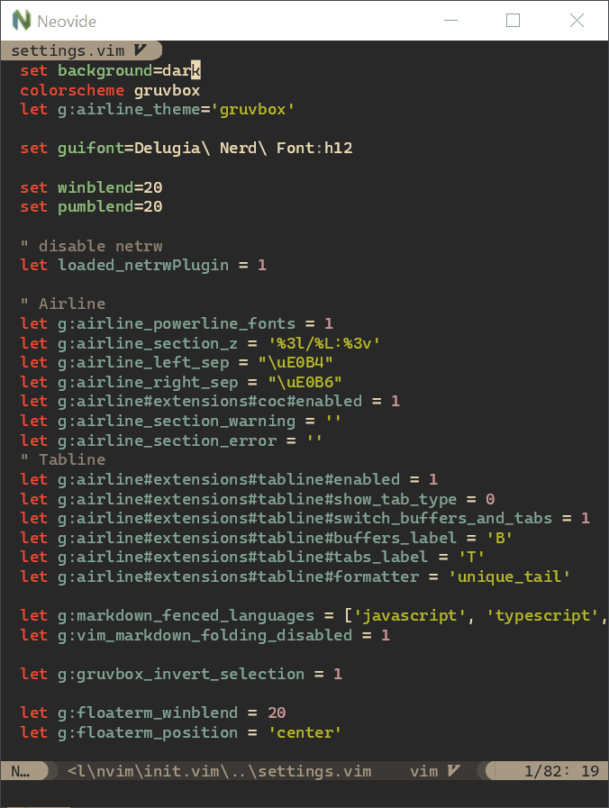
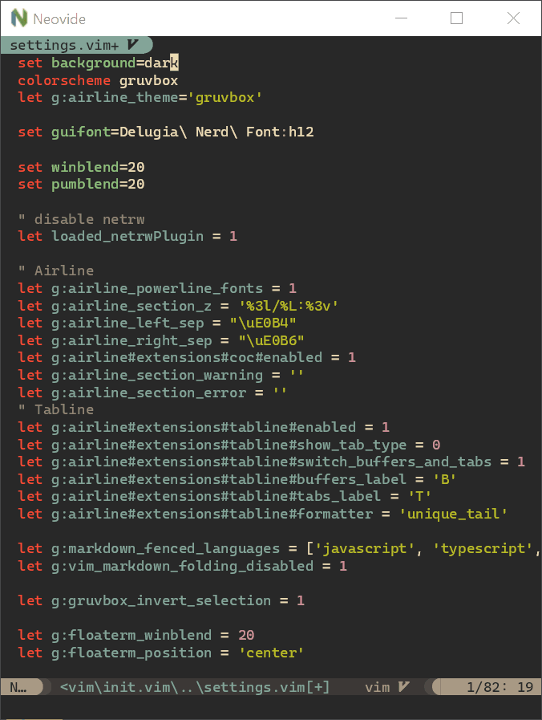
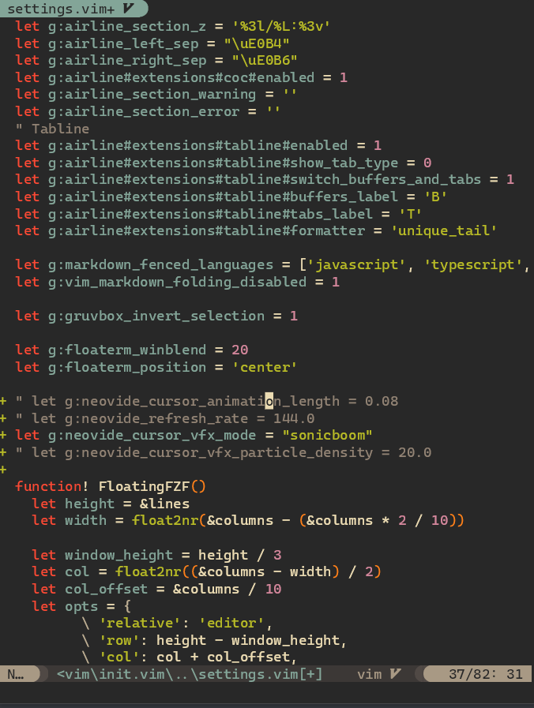
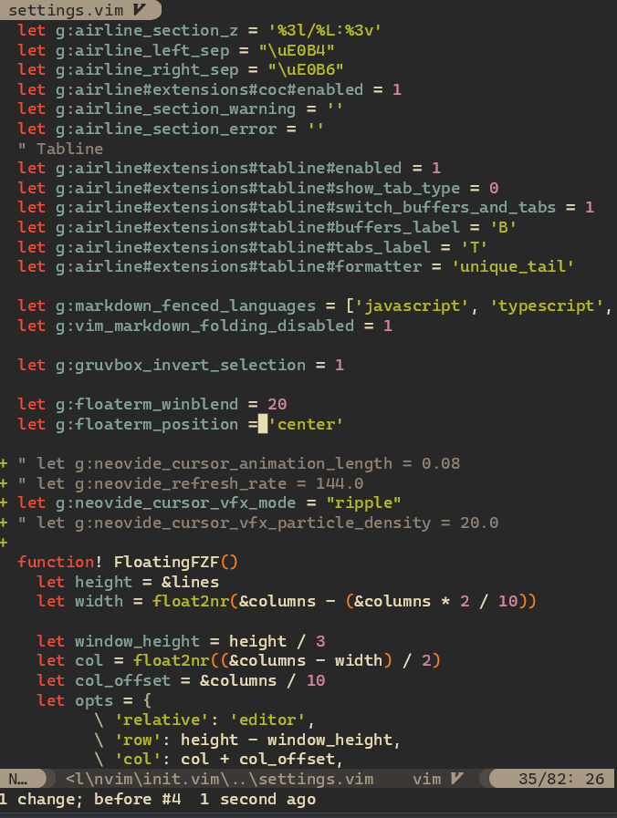
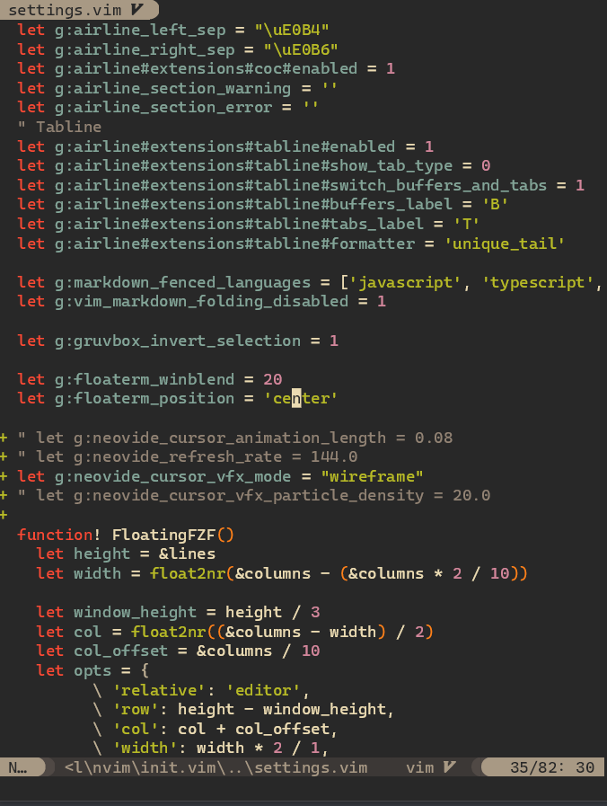

# Neovide [](https://gitter.im/neovide/community?utm_source=badge&utm_medium=badge&utm_campaign=pr-badge)

This is a simple graphical user interface for Neovim. Where possible there are some graphical improvements, but it should act
functionally like the terminal UI.


I've been using this as my daily driver since November 2019. It should be relatively stable, but I'm still working out some kinks
and ironing out some cross platform issues. In general it should be usable at this point, and if it isn't I consider that a bug and
appreciate a report in the issues! Any help and ideas are also greatly appreciated.

I'm also very interested in suggestions code quality/style wise when it comes to Rust. I'm pretty new to the language and appreciate
any critiques that you might have to offer. I won't take all of them, but I promise to consider anything you might have to offer.

## Features

Should be a standard full features Neovim GUI. Beyond that there are some visual niceties:

### Ligatures

Supports ligatures and full [HarfBuzz](https://www.freedesktop.org/wiki/Software/HarfBuzz/) backed font shaping.


### Animated Cursor

Cursor animates into position with a smear effect to improve tracking of cursor position.


### Emoji Support

Font fallback supports rendering of emoji not contained in the configured font.


#### More to Come

I've got more ideas for simple unobtrusive improvements. More to come.

## Some Nonsense ;)

### Cursor Trails and Attention Grabbers

These are configurable via the `g:neovide_cursor_vfx_mode` global variable.

#### Railgun

```
let g:neovide_cursor_vfx_mode = "railgun"
```



#### Torpedo

```
let g:neovide_cursor_vfx_mode = "torpedo"
```



#### Pixiedust

```
let g:neovide_cursor_vfx_mode = "pixiedust"
```


#### Sonic Boom

```
let g:neovide_cursor_vfx_mode = "sonicboom"
```



#### Ripple

```
let g:neovide_cursor_vfx_mode = "ripple"
```



#### Wireframe

```
let g:neovide_cursor_vfx_mode = "wireframe"
```




## Install

Currently there is just a Windows binary under the [project releases](https://github.com/Kethku/neovide/releases). I'm
hoping to automate and produce Mac and Linux binaries as well, but I haven't gotten there yet.

Installing should be as simple as downloading the binary, making sure `nvim.exe` with version 0.4 or greater is on your path, and running it. Everything should be self contained.

## Building

Building instructions are somewhat limited at the moment. All the libraries I use are cross platform and should have
support for Windows, Mac, and Linux. The rendering however is Vulkan-based, so driver support for Vulkan will be
necessary. On Windows this should be enabled by default if you have a relatively recent system.

Note: Neovide requires neovim version 0.4 or greater.

### Windows

1. Install the latest version of Rust. I recommend <https://rustup.rs/>
2. Install CMake. I use chocolatey: `choco install cmake --installargs '"ADD_CMAKE_TO_PATH=System"' -y`
3. Install LLVM. I use chocolatey: `choco install llvm -y`
4. Ensure graphics libraries are up to date.
5. `git clone https://github.com/Kethku/neovide`
6. `cd neovide`
7. `cargo build --release`
8. Copy `./target/release/neovide.exe` to a known location and enjoy.

### Mac

1. Install the latest version of Rust. I recommend <https://rustup.rs/>
2. Install CMake. Using homebrew: `brew install cmake`
3. Install the Vulkan SDK. I'm told `brew cask install apenngrace/vulkan/vulkan-sdk` works, but I can't test locally to find out.
4. `git clone https://github.com/Kethku/neovide`
5. `cd neovide`
6. `cargo build --release`
7. Copy `./target/release/neovide` to a known location and enjoy.

Note: If you run into issues with the vulkan libraries being reported as not verified, this issue thread may help: https://github.com/Kethku/neovide/issues/167#issuecomment-593314579

### Linux

#### Debian/Ubuntu

Note: Neovide has been successfully built on other distros but this reportedly works on Ubuntu.

1. Install necessary dependencies

    ```sh
    sudo apt-get install -y curl \
        gnupg ca-certificates git \
        gcc-multilib g++-multilib cmake libssl-dev pkg-config \
        libfreetype6-dev libasound2-dev libexpat1-dev libxcb-composite0-dev \
        libbz2-dev libsndio-dev freeglut3-dev libxmu-dev libxi-dev
    ```

2. Install Vulkan SDK

    ```sh
    curl -sL "http://packages.lunarg.com/lunarg-signing-key-pub.asc" | sudo apt-key add -
    sudo curl -sLo "/etc/apt/sources.list.d/lunarg-vulkan-1.2.131-bionic.list" "http://packages.lunarg.com/vulkan/1.2.131/lunarg-vulkan-1.2.131-bionic.list"
    sudo apt-get update -y
    sudo apt-get install -y vulkan-sdk
    ```

3. Install Rust

    `curl --proto '=https' --tlsv1.2 -sSf "https://sh.rustup.rs" | sh`

4. Clone the repository

    `git clone "https://github.com/Kethku/neovide"`

5. Build

    `~/.cargo/bin/cargo build --release`

6. Copy `./target/release/neovide` to a known location and enjoy.

If you see an error complaining about DRI3 settings, links in this issue may help:
<https://github.com/Kethku/neovide/issues/44#issuecomment-578618052>.
